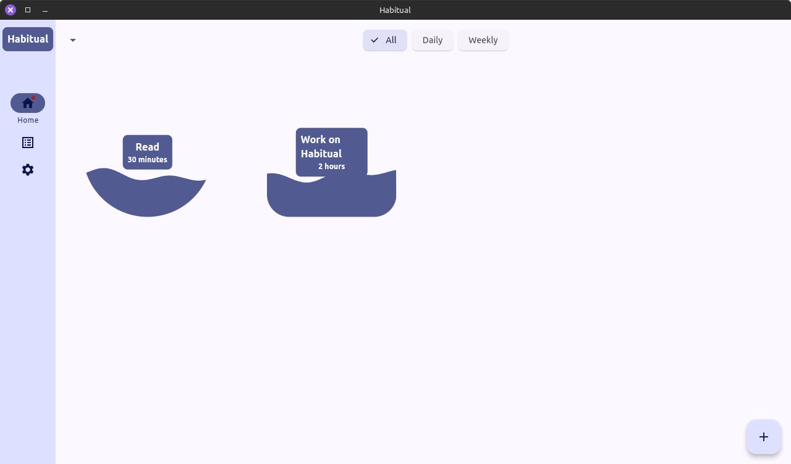
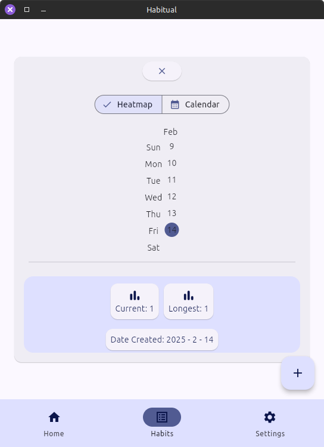
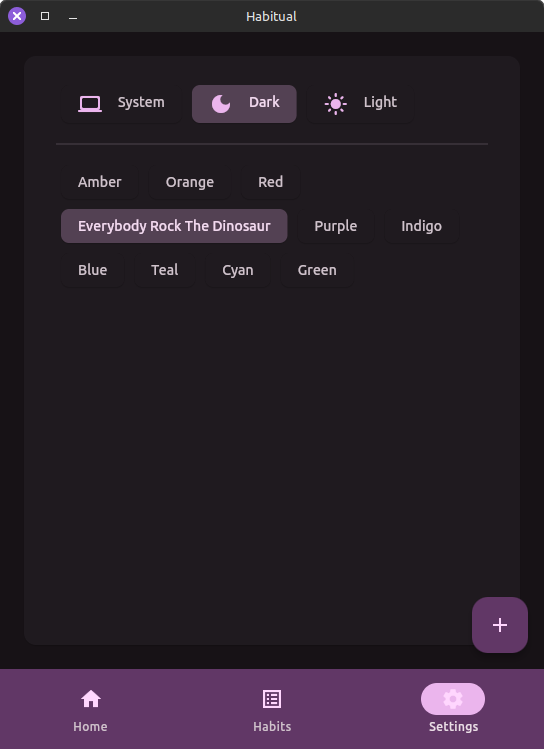

# <p style="text-align: center;">Habitual</p>

Make growth *habitual*.






## Overview

*Habitual* is a minimalist habit tracker that helps you manage your goals or track recurring tasks.

While this was developed as a learning experience for the Flutter framework and a hands-on exploration of its capabilities, it is a fully functional application.

## Build
[Install Flutter](https://docs.flutter.dev/get-started/install).

Clone this repository and build with:
```
flutter build [your_device_type]
```

## Version
1.0
