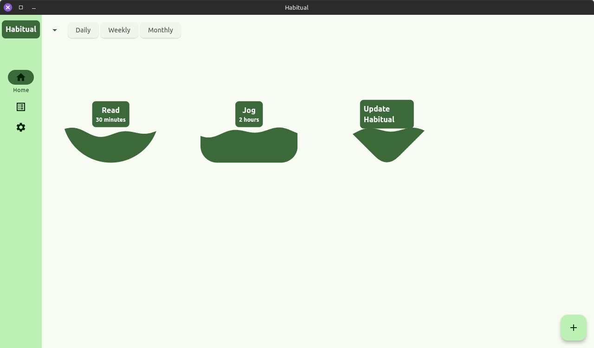
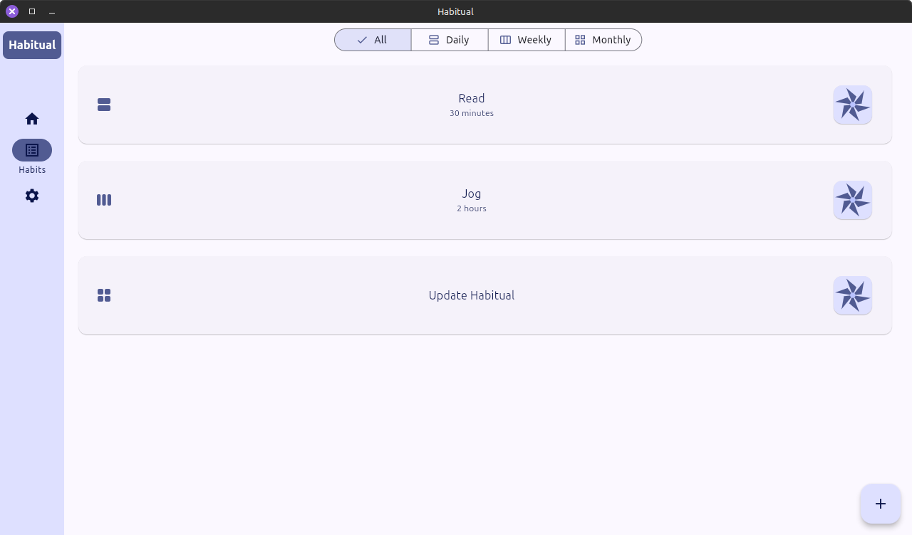
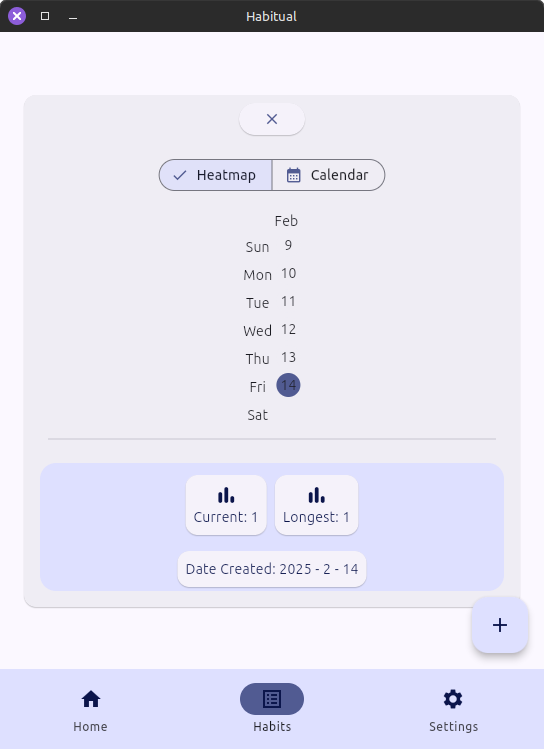
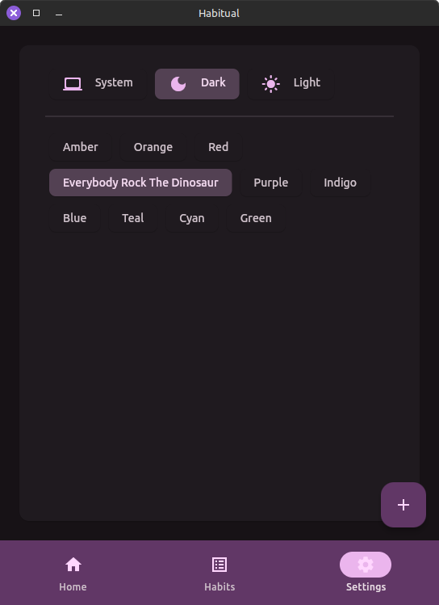
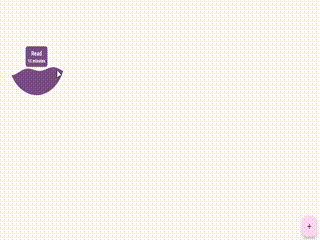
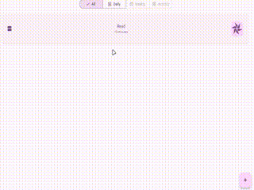
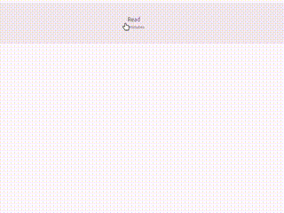

<p style="text-align: center;"></p>

# <p style="text-align: center;">Habitual</p>

Make growth *habitual*.

## Overview

*Habitual* is a minimalist habit tracker that helps you manage your goals or track recurring tasks.

While this was developed as a learning experience for the Flutter framework and a hands-on exploration of its capabilities, it is a fully functional application.

## Screenshots








## Usage

- Create habits to track your daily, weekly or monthly goals using the quick action.
> 

- Show your progress by filling your goal with either the built-in timer or long pressing.
> 

- Track your habits and see how you are doing on the **List View**. The pinwheel reflects your current streak, increasing in speed as you meet your goals.
> 

- Delete a habit from the **List View** by long pressing. 
> 

## Install

- ### Use a release

    Download one of the included releases for your preferred platform. Currently available:

    | Platform | Available |
    | -------- | :---------: |
    | Android  | :white_check_mark: |
    | iOS      |     :x:   |
    | Linux    | :white_check_mark: |
    | Mac      |     :x:   |
    | Windows  |     :x:   |


    #### Releases:
    - ##### Android
        Download the APK and install. You will receive a notice about installing from an untrusted source.
    - ##### Linux
        Download and extract the .tar.gz archive. Place the resulting Habitual_$Version folder where you would like then run the install script.

- ### Build yourself

    [Install Flutter.](https://docs.flutter.dev/get-started/install)

    Clone this repository and build with:

    ```
    flutter build [your_device_type]
    ```

## Version

1.1.1
